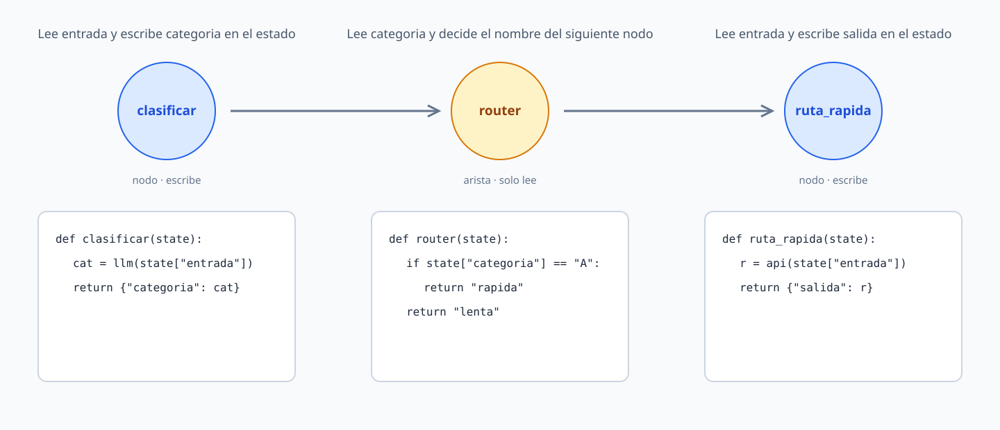

# Agentes con LangGraph

## 1. Introducción

Este tutorial presenta los fundamentos estructurales de LangGraph, la librería que permite construir agentes inteligentes modelando su flujo de ejecución como un grafo dirigido con estado. En el tutorial anterior se vio cómo usar LangChain y LangGraph para construir un agente sencillo. Este tutorial profundiza en la arquitectura de LangGraph: qué es el estado compartido, qué son los nodos, cómo se conectan con aristas y por qué esta estructura permite construir comportamientos que una cadena lineal no puede expresar.



A lo largo del tutorial se construirán cuatro ejemplos prácticos de complejidad creciente:

1. Un pipeline de preprocesamiento de texto con flujo lineal.
2. Un agente de triaje de soporte con ramificación condicional.
3. Un contador cíclico que ilustra la mecánica de los bucles en LangGraph.
4. Una comparación directa entre una cadena LCEL y un grafo para resolver el mismo problema de traducción y resumen.

## ¿Qué va a aprender?

En este tutorial aprenderá a:

- Comprender las limitaciones de las cadenas lineales (LCEL) para modelar agentes y por qué los grafos de estado las superan.
- Definir el estado compartido de un agente usando `TypedDict` como contrato entre todos los nodos.
- Implementar nodos como funciones puras que reciben el estado completo y retornan actualizaciones parciales.
- Conectar nodos con aristas fijas y condicionales para controlar el flujo de ejecución en tiempo de ejecución.
- Construir grafos con ciclos que permiten iterar hasta que se cumpla una condición de salida.
- Visualizar la estructura de un grafo usando Mermaid, ASCII art y PNG.
- Decidir cuándo usar una cadena LCEL y cuándo escalar a un grafo de LangGraph.

## ¿Qué va a construir?

Al finalizar este tutorial tendrá:

- Un pipeline de preprocesamiento de mensajes implementado como un grafo lineal de tres nodos.
- Un agente de triaje de tickets de soporte con ramificación condicional hacia tres handlers especializados.
- Un grafo cíclico de contador que demuestra la mecánica de los bucles en LangGraph.
- Una implementación comparativa del mismo problema —traducir y resumir un texto— usando LCEL y LangGraph para contrastar los dos enfoques.

## ¿Qué necesita?

Para completar el tutorial necesita:

- Conocimientos básicos de Python y su sintaxis.
- Python 3.10.0 o superior instalado en su sistema operativo.
- Acceso a la terminal o línea de comandos de su sistema operativo.
- Ollama instalado y funcionando en su sistema operativo.
- Al menos 4 GB de RAM disponibles y aproximadamente 2 GB de espacio en disco para el modelo local.

## 2. Configuración del entorno de desarrollo

En esta sección se configura el entorno de desarrollo necesario para ejecutar el resto del tutorial. Cree y active un entorno virtual de Python antes de continuar. Esto aísla las dependencias específicas del proyecto de las librerías instaladas en el sistema, evita conflictos y garantiza una ejecución reproducible y consistente.

Recuerde activar siempre el entorno virtual antes de trabajar en el proyecto.

### Creación y activación del entorno virtual

En macOS o Linux:

```bash
python3 -m venv .venv
source .venv/bin/activate
```

En Windows:

```powershell
py -m venv .venv
.venv\Scripts\Activate.ps1
```

### Instalación de librerías

Con el entorno virtual activado, ejecute:

```bash
pip install -r requirements.txt
```

Este comando instala, entre otras dependencias:

- `langchain-ollama`, que integra LangChain con los modelos de lenguaje administrados localmente por Ollama.
- `langchain-core`, que proporciona prompts, mensajes, parsers y cadenas.
- `langgraph`, que permite construir el flujo del agente como un grafo dirigido con estado mutable.
- `grandalf`, requerida por LangGraph para renderizar diagramas en ASCII art directamente en la terminal.

### Verificación de la instalación

Abra una sesión interactiva de Python con `python` en Windows o `python3` en macOS y Linux. A continuación, ejecute:

```python
from langchain_core.prompts import ChatPromptTemplate
from langchain_ollama import ChatOllama
import langgraph
```

Si no se produce ningún error, la instalación se realizó correctamente y el entorno está listo para continuar con el tutorial.

> **Nota**
> Si `pip` muestra errores relacionados con versiones o dependencias faltantes, compruebe que el entorno virtual está activado y que usa Python 3.10.0 o superior. Puede actualizar `pip` con `pip install --upgrade pip` e intentar la instalación nuevamente.
